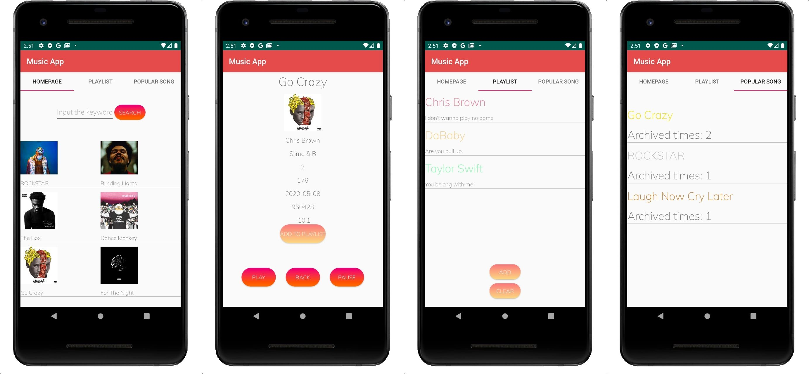

# Music App

This is a Music application with multiple functions.

## About

1. User can view popular songs on the index page.

2. User can search songs by artists or song name.

3. User can view details of each of the song and play a 15s demo in the information page.

4. User can create playlists and add their favorite song to it.

5. User can see their most favorite songs.

   

## Built With

1. Kotlin
2. XML
3. Coroutines
4. Android Architecture Components
   1. ViewModel
   2. ViewBinding
   3. LiveData
   4. Room
5. RetroFit
6. Deezer API
7. Moshi
8. Picasso
9. Rest

## Contact

If you need any help, please contact me via yunxiuqiu@wustl.edu